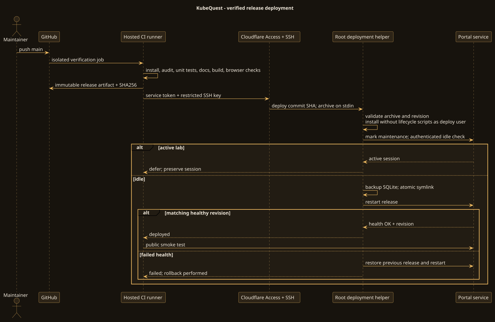

# GitHub CI/CD pipeline

[Open GitHub Actions](https://github.com/ramideltoro/kubequest/actions) · [Production portal](https://kubequest.ramideltoro.com) · [Production deployment history](https://github.com/ramideltoro/kubequest/deployments)

The main workflow is `.github/workflows/ci-cd.yml`. Pull requests run verification without production credentials. Pushes to `main`, and manual runs selected on `main`, run the same checks and then deploy the verified artifact to the existing server. The production environment only permits the `main` branch.

## Verification gate

1. Check out the exact revision with persisted Git credentials disabled.
2. Install the locked dependency graph under Node 22.22.1, without package lifecycle scripts.
3. Fail on known high/critical dependency vulnerabilities.
4. Run content, authorization, lifecycle and deployment-archive tests.
5. Check wiki links, required diagrams and source/render hashes.
6. Type-check and build the frontend, including the versioned wiki assets.
7. Run Chromium through all ten anonymous lesson completions, wrong-answer feedback, local progress restoration, responsive routes, WCAG checks, footer search, keyboard behavior and private-API rejection.
8. Save browser screenshots as workflow evidence and create a release archive with its SHA256 checksum.

Artifacts are retained for 14 days. The archive contains compiled frontend assets, server/content/infrastructure files, locked production dependencies metadata, and `RELEASE.json`. It does not contain runtime secrets, a database, VM images, private keys, or `node_modules`.

## Deployment

The deployment job downloads the exact artifact from the verification job and verifies its checksum. A pinned, checksum-verified Cloudflare client opens the established machine-authenticated SSH route. Host-key verification is mandatory. A dedicated SSH key logs in as `kubequest-deploy`; a forced receiver rejects every command except `deploy <40-character SHA>` and `rollback <40-character SHA>`.

The root-owned helper takes an exclusive lock, receives a bounded archive, validates paths/types/size, checks the requested revision, and extracts as the deployment user. It runs `npm ci --omit=dev --ignore-scripts` without root privileges. The staged release becomes root-owned and is installed at `/opt/kubequest/releases/<commit SHA>`. Retrying the same deployment reuses the installed immutable release.

Before activation, a maintenance marker blocks new lab starts/resets. A short-lived locally signed owner token is used only by the root helper to read private session status. No authentication-bypass endpoint is installed. If a lab exists, deployment fails with a clear deferred message and leaves the running session intact. Stop the lab normally and rerun the failed job.

For an idle portal, the helper starts the SQLite backup service, atomically replaces `/opt/kubequest/current`, restarts the service, and verifies health, authentication configuration, lab readiness and the exact revision. A failed local health check restores the old symlink and restarts the previous release. The workflow then verifies the public hostname, important routes and anonymous private-API denial.

A public smoke failure after local success marks the workflow failed and requires investigation; it does not automatically roll back a healthy local service for a transient Cloudflare/network outage.

## Secrets and permissions

The GitHub **production** environment stores four secrets: `DEPLOY_SSH_KEY`, `DEPLOY_KNOWN_HOSTS`, `CF_ACCESS_CLIENT_ID`, and `CF_ACCESS_CLIENT_SECRET`. Values are never part of repository files or generated wiki pages. Cloudflare machine authentication uses the existing local-server access integration. The SSH key is specific to KubeQuest.

The workflow token has read-only repository permission. Actions are pinned to full SHAs. Public pull requests have no deploy path; no self-hosted runner or `pull_request_target` workflow is used. Deployment jobs serialize and are not canceled halfway through a release switch.

## Manual rollback

Open **Actions → Roll back production → Run workflow**, choose `main`, and enter the full SHA of a previously installed release. The rollback workflow uses the same tunnel, forced command, idle guard, backup and health checks. It does not reinstall packages or accept arbitrary filesystem paths.

Rollback changes application code only; it does not roll back SQLite. A schema-changing release requires separately reviewed migration/recovery instructions. Do not choose an application version that cannot read the current database.

## Maintaining the pipeline

- Change source or wiki files on a branch, review the diff and CI results, then merge to `main`.
- For helper changes, first test them, then install the trusted helper files on the host using an administrator connection. Application deployments intentionally cannot replace root-owned deployment logic.
- Update Node, action SHAs, Cloudflare version/checksum and dependencies deliberately; rerun verification.
- For grader, image or lab-controller changes, run the real-cluster qualification suite during a maintenance window. Fast hosted CI does not claim to boot the production KVM lab.
- Local release directories are retained for rollback and need periodic administrator pruning after confirming which release is active. Artifact retention and server release retention are separate.
